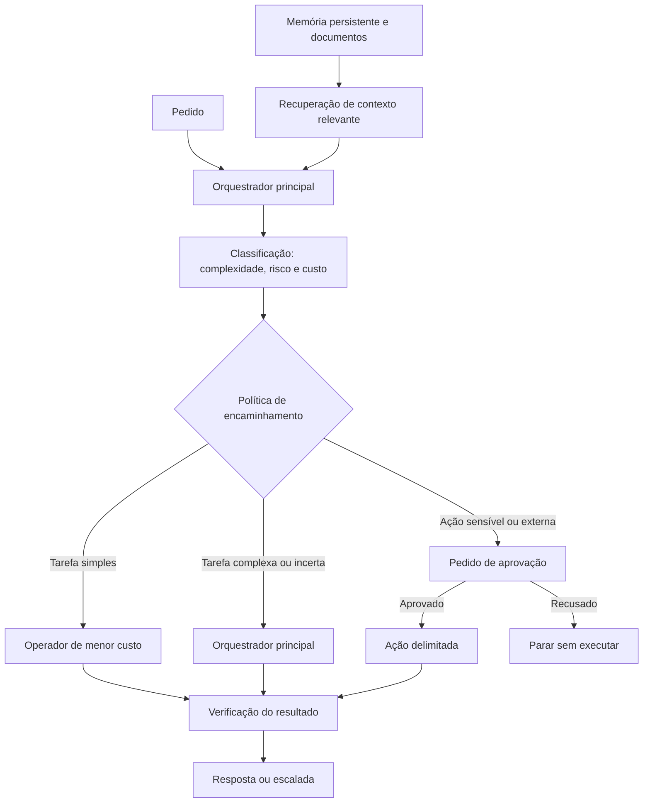

# Jarvis / OmniRoute

**Estado:** estudo de arquitetura de um sistema privado de automação e orquestração pessoal.

Jarvis é a interface de trabalho; OmniRoute decide como encaminhar tarefas para modelos e operadores especializados. O código, as configurações e os dados pessoais permanecem privados. Este texto documenta decisões de engenharia sem publicar *prompts* privados, credenciais, endereços internos ou detalhes de autenticação.

## Problema

Usar o modelo mais caro e capaz para todas as tarefas aumenta o custo e não melhora todos os resultados. Por outro lado, delegar sem limites cria falhas difíceis de detetar e resultados que podem não ter sido verificados.

O sistema separa a interpretação da tarefa da sua execução. O orquestrador decide se responde diretamente, encaminha uma parte delimitada para um operador ou pede validação adicional.

## Arquitetura

O orquestrador conserva a responsabilidade pelo objetivo, pelo contexto e pela resposta final. Os operadores recebem tarefas menores com critérios de conclusão explícitos. Esta separação permite escolher recursos diferentes sem transferir o controlo do fluxo.

## Encaminhamento e recuperação de falhas

A política pondera a complexidade, o custo, a disponibilidade da rota e a necessidade de verificação. Tarefas simples podem seguir por operadores de menor custo; tarefas ambíguas ou com maior impacto regressam ao orquestrador principal ou pedem validação adicional.

As tentativas são limitadas. Quando uma rota falha ou deixa de estar disponível, o sistema pode tentar uma alternativa permitida ou devolver um estado de falha controlado. Uma falha nunca deve ser apresentada como trabalho concluído. O resultado de um operador passa por verificação antes de ser integrado.

A separação entre orquestração e operadores também reduz o alcance de cada componente: um operador recebe apenas a tarefa e as ferramentas necessárias, em vez de acesso irrestrito ao fluxo completo.

## Memória e recuperação de conhecimento

A memória é tratada como uma fonte separada, não como um bloco de texto acrescentado a todos os pedidos. Preferências estáveis, contexto de projetos e documentos de referência podem ter ciclos de vida diferentes. Para cada tarefa, a recuperação deve fornecer apenas as notas relevantes e preservar a origem do contexto.

Esta abordagem limita o ruído, facilita a atualização da informação e reduz a exposição de dados desnecessários. A camada de recuperação e a respetiva cobertura continuam em desenvolvimento; este estudo não afirma que exista um serviço genérico de RAG concluído.

## Modos de operação

O desenho distingue três necessidades:

- **Normal:** recursos e rotas adequados a tarefas interativas e trabalho mais exigente.
- **Leve ou em segundo plano:** tarefas delimitadas com menor consumo e concorrência.
- **Jogo:** reduz ou suspende trabalho que possa competir por recursos durante uma sessão de jogo.

O modo de jogo existe para controlar a utilização de recursos, não para mudar o conteúdo das respostas. A disponibilidade e os controlos concretos dependem da configuração local e não são publicados neste estudo.

## Aprovação e integrações

O sistema pode automatizar trabalho reversível e de baixo risco. Ações externas, sensíveis ou com custo relevante devem parar para pedir aprovação explícita. O ponto de aprovação surge antes da ação, para que o utilizador saiba o que será executado.

As integrações são adaptadores em torno do orquestrador. A arquitetura considera automação de páginas e do navegador, notificações, uma interface de mensagens, gestão de conhecimento pessoal, fluxos de trabalho com livros eletrónicos, impressão 3D e automação de projetos. Estes exemplos descrevem superfícies de integração, mas não significam que todos os fluxos estejam concluídos ou ativos.

## Estado do trabalho

- **Implementado na base privada:** separação entre orquestração e operadores, regras de encaminhamento e controlos limitados de repetição e contingência.
- **Em desenvolvimento:** prontidão das rotas de execução, cobertura da verificação e recuperação seletiva de contexto.
- **Em exploração ou planeado:** integrações adicionais, incluindo mensagens, notificações e fluxos de trabalho pessoais especializados.

A execução de uma rota depende da configuração local. Por isso, este caso de estudo descreve a arquitetura e as decisões, não promete disponibilidade contínua nem apresenta código privado como prova pública.

## Decisões de engenharia

- **Orquestrador separado dos operadores:** mantém um único responsável pelo objetivo e permite limitar cada tarefa delegada.
- **Modelos de menor custo para trabalho delimitado:** reserva recursos mais capazes para síntese, ambiguidades e escalada.
- **Verificação antes da integração:** impede que uma resposta do operador passe diretamente por resultado confirmado.
- **Aprovação junto das ações sensíveis:** preserva a autonomia em tarefas seguras e mantém controlo humano nas ações de maior impacto.
- **Memória modular:** recupera contexto por relevância e mantém separadas preferências, informação de projeto e documentos.
- **Degradação controlada:** rotas indisponíveis devem produzir uma alternativa permitida, uma escalada ou uma falha explícita, nunca uma falsa confirmação.
- **Modo de jogo:** reconhece que um assistente pessoal também tem de respeitar os recursos necessários a outras atividades.
