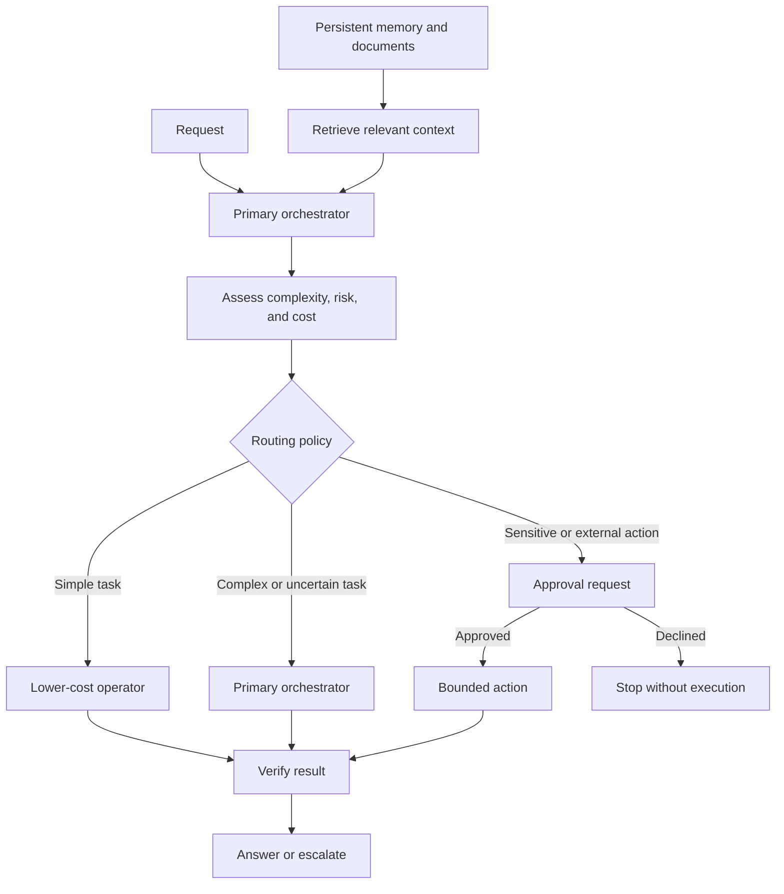

# Jarvis / OmniRoute

**Status:** Architecture case study for a private personal automation and orchestration system.

Jarvis is the work interface. OmniRoute decides how tasks reach models and specialized operators. The source code, configuration, and personal data remain private. This case study describes engineering decisions without publishing private prompts, credentials, internal addresses, or authentication details.

## Problem

Using the most capable model for every task raises cost without improving every result. Delegating without boundaries makes failures harder to detect and results harder to verify.

The system separates task interpretation from execution. The orchestrator decides whether to answer directly, delegate a bounded task, or request additional verification.

## Architecture

The orchestrator remains responsible for the goal, context, and final answer. Operators receive smaller tasks with clear completion criteria. This separation lets the system choose different resources without giving up control of the workflow.

## Routing and failure handling

The policy considers complexity, cost, route availability, and the need for verification. Simple tasks can go to lower-cost operators. Ambiguous or higher-impact work returns to the primary orchestrator or requests additional review.

Retries are bounded. If a route fails or becomes unavailable, the system can try an allowed alternative or return a controlled failure. It must not present failed work as complete. Operator output is checked before it is used in the final result.

Separating orchestration from operators also limits each component's access. An operator receives the task and tools it needs, rather than unrestricted control of the full workflow.

## Memory and retrieval

Memory is a separate source, not one large block of text attached to every request. Stable preferences, project context, and reference documents can have different lifecycles. Retrieval should provide only the notes relevant to a task and preserve where that context came from.

This limits noise, makes information easier to update, and avoids exposing unnecessary data. Context retrieval and its coverage remain in development. This case study does not claim that a general-purpose RAG service is complete.

## Operating modes

The design supports three different needs:

- **Normal:** routes and resources for interactive work and more demanding tasks.
- **Lightweight or background:** bounded tasks with lower resource use and concurrency.
- **Gaming:** reduces or pauses work that could compete for resources during a game session.

Gaming mode manages resource use. It does not change the content of answers. Specific controls depend on the local configuration and are not published here.

## Approvals and integrations

The system can automate reversible, low-risk work. External, sensitive, or materially costly actions should stop for explicit approval before execution.

Integrations use adapters around the orchestrator. The architecture covers browser automation, notifications, a messaging interface, personal knowledge management, ebook workflows, 3D printing, and project automation. These are integration areas, not a claim that every workflow is complete or active.

## Work status

- **Implemented in the private system:** separation between orchestration and operators, routing rules, and bounded retry and fallback controls.
- **In active development:** execution-route readiness, verification coverage, and selective context retrieval.
- **Explored or planned:** additional integrations, including messaging, notifications, and specialized personal workflows.

Route execution depends on local configuration. This case study describes the design and its trade-offs. It does not promise continuous availability or present private code as public evidence.

## Engineering decisions

- **Separate the orchestrator from operators:** keep one component accountable for the goal and limit each delegated task.
- **Use lower-cost models for bounded work:** reserve more capable resources for synthesis, uncertainty, and escalation.
- **Verify before integration:** do not treat an operator response as a confirmed result.
- **Put approval before sensitive actions:** keep safe automation moving while preserving human control over higher-impact work.
- **Keep memory modular:** retrieve relevant context while separating preferences, project information, and reference documents.
- **Fail in a controlled way:** an unavailable route should lead to an allowed alternative, escalation, or explicit failure.
- **Add gaming mode:** let the assistant respect resources needed by other activities.
